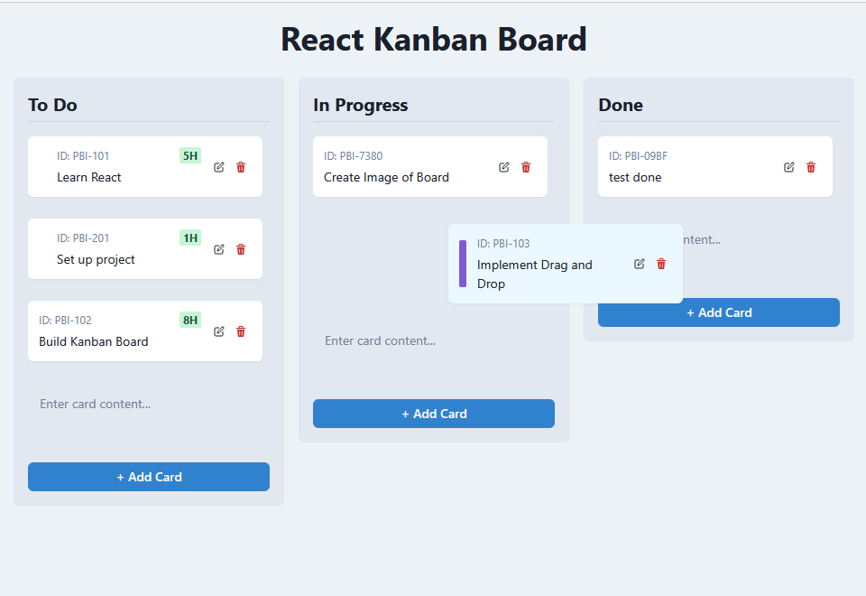

# Ridvay Code Showcase: React Kanban Board

This project serves as a demonstration of the capabilities of **Ridvay Code**, an AI-powered software engineer. The `react-kanban-board` application within this repository was developed entirely by Ridvay Code, with human involvement limited to providing the initial prompts and requirements.

The goal is to showcase how Ridvay Code can understand tasks, plan execution, interact with development tools (like file system operations, command execution, and browser interaction), write code, and iterate based on feedback, ultimately producing a functional application.

## Project: React Kanban Board

The specific application built is a simple Kanban board using React and TypeScript. You can find its dedicated README [here](./react-kanban-board/README.md).

## How it Was Built

This entire project, including this README, was generated by Ridvay Code without direct human coding intervention.

## Using Ridvay Code

Ridvay Code primarily operates through its **VS Code extension**. To interact with it:

1.  **Provide Prompts:** Give clear, detailed instructions for the task you want Ridvay Code to perform (e.g., "Create a new React component for user profiles," "Refactor the database connection logic," "Add tests for the login function").
2.  **Review and Guide:** Ridvay Code will break down the task, suggest steps (often involving tool usage like reading/writing files, running commands, or browsing), and execute them upon your approval. Review the planned actions and results.
3.  **Iterate:** Provide feedback if the results aren't quite right or if requirements change. Ridvay Code can adjust its approach based on your input.

*(Note: Ensure the Ridvay Code VS Code extension is installed and activated. Alternatively, you can use Ridvay Code within development environments like GitHub Codespaces where the extension might be pre-installed or easily added.)*

## Extending this Project with Ridvay Code

You can continue developing this Kanban board (or start a new project) using Ridvay Code:

1.  **Set up your Environment:** Ensure you have Node.js and npm installed, and clone this repository if you haven't already.
2.  **Activate Ridvay Code:** Open this project in your IDE where the Ridvay Code extension is active.
3.  **Give Instructions:** Ask Ridvay Code to add new features, fix bugs, or refactor existing code. Examples:
    *   "Add the ability to set due dates for cards."
    *   "Change the styling of the 'Done' column."
    *   "Implement user authentication."
    *   "Write unit tests for the Card component."
4.  **Follow the Process:** Approve the steps Ridvay Code proposes to modify the codebase.

Ridvay Code will handle file modifications, package installations (via `npm` or `yarn` commands), and potentially even testing or previewing the changes.

## UI Preview

