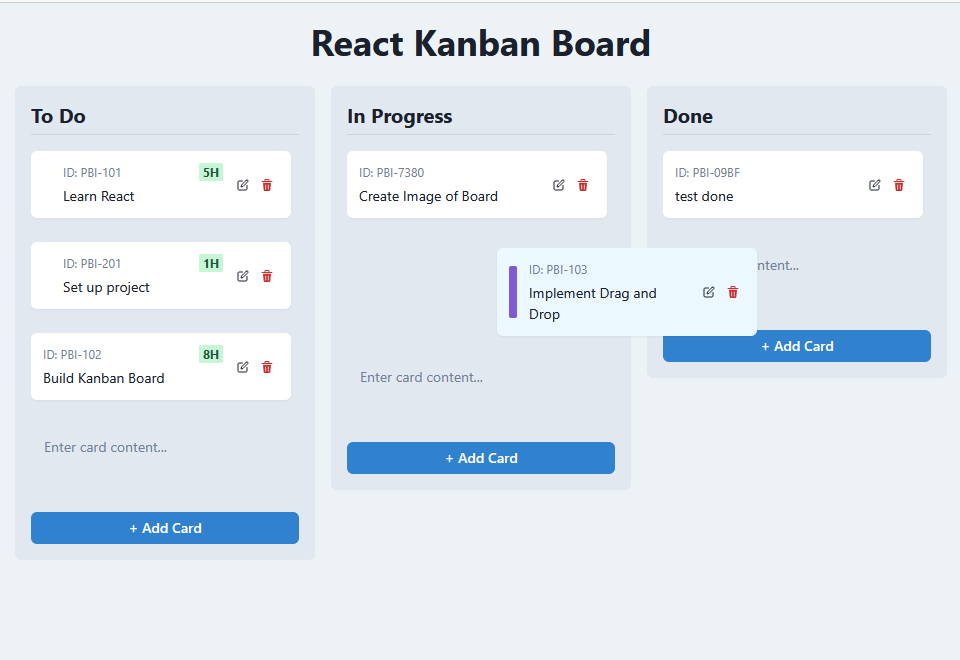

# React Kanban Board

This is a simple Kanban board application built with React and TypeScript.

## Features

*   Drag-and-drop cards between columns.
*   Add new cards to columns.
*   Edit existing card details.
*   Basic column structure (e.g., To Do, In Progress, Done).

## Built with Ridvay Code

This entire application was developed by **Ridvay Code**, an AI software engineer. Human involvement was limited to providing the initial prompts and requirements. This project demonstrates Ridvay Code's ability to generate functional web applications.

## Getting Started

1.  **Install dependencies:**
    ```bash
    npm install
    ```
2.  **Run the development server:**
    ```bash
    npm run dev
    ```
    The application will be available at `http://localhost:5173` (or the next available port).

## UI Preview

